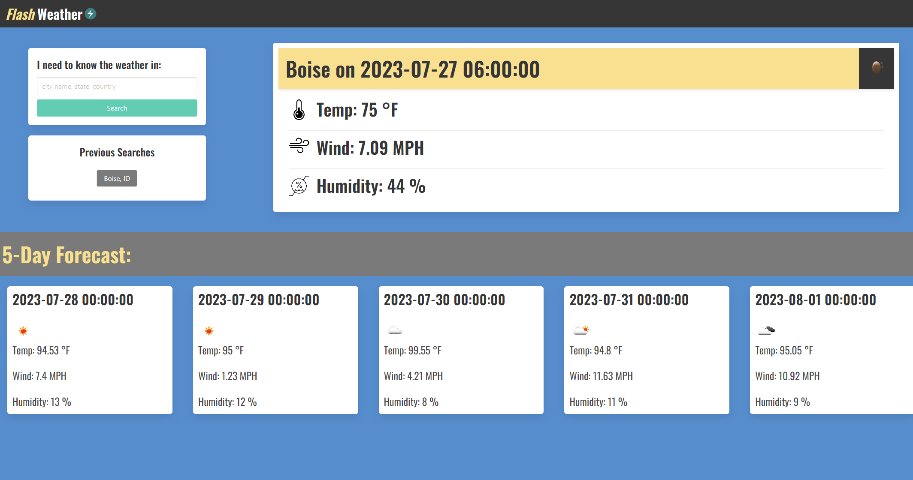

# Module Six Challenge: Server-Side API Weather Dashboard

## Description
Using [OpenWeather APIs](https://openweathermap.org/api), we must create a weather dashboard/forecast app. In addition to the meeting the requirements below, [Bulma](https://openweathermap.org/api) was used as a CSS framework instead of Bootstrap.


## Acceptance Criteria

Minimun viable product must include the following functionality/features:

```
GIVEN a weather dashboard with form inputs

WHEN I search for a city
THEN I am presented with current and future conditions for that city and that city is added to the search history

WHEN I view current weather conditions for that city
THEN I am presented with the city name, the date, an icon representation of weather conditions, the temperature, the humidity, and the wind speed

WHEN I view future weather conditions for that city
THEN I am presented with a 5-day forecast that displays the date, an icon representation of weather conditions, the temperature, the wind speed, and the humidity

WHEN I click on a city in the search history
THEN I am again presented with current and future conditions for that city

```

## Mock-Up

The following is a preview of the final product:


The latest version of the webpage is active at:

https://omar-razo.github.io/server-side-api-weather-app/

## Installation

N/A

## Credits


MDN web docs was visited to address a null error I was having with localStorage:

https://developer.mozilla.org/en-US/docs/Web/JavaScript/Reference/Operators/Nullish_coalescing


The two OpenWeather APIs used:

https://openweathermap.org/api/geocoding-api

https://openweathermap.org/forecast5
